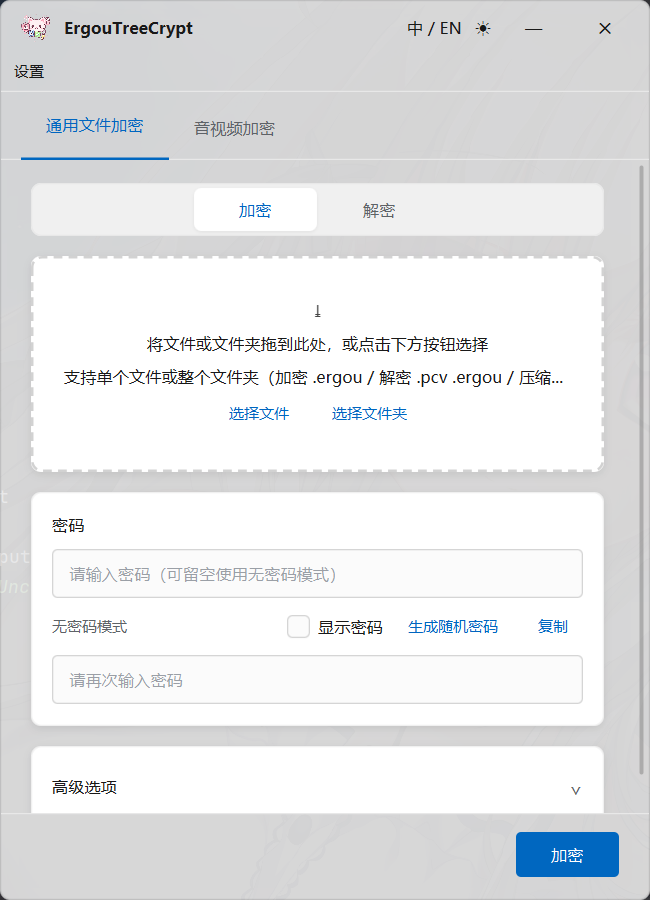

# ErgouTreeCrypt

<p align="center">
  
</p>

<p align="center">
  <strong>安全 · 可靠 · 现代 · 快速</strong><br>
  <em>Secure · Reliable · Modern · Swift</em>
</p>

<p align="center">
  <a href="#-项目简介">中文</a> ·
  <a href="#features">English</a> ·
  <a href="#-快速开始">快速开始</a> ·
  <a href="#-功能详解">功能详解</a> ·
  <a href="#-构建与运行">构建</a>
</p>

---

## 📖 项目简介

**ErgouTreeCrypt** 是一款基于 Java 21 + JavaFX 的桌面端文件加密工具，是 [Picocrypt-NG](https://github.com/Picocrypt/Picocrypt-NG) (Go 语言) 的 Java 增强移植版。它在完全兼容原有 `.pcv` 加密文件解密的基础上，对音视频内容的加密做出了特殊的专用处理，而且新增了 **音视频格式保持加密**（MP3/MP4/WAV）子系统，并对 UI、选项和可用性做了大量增强。

### 核心能力一览


| 能力                     | 说明                                                       |
| ------------------------ | ---------------------------------------------------------- |
| 🔐**通用文件加密/解密**  | 对任意文件/文件夹进行高强度加密，输出`.ergou` 加密卷       |
| 🎵**音视频格式保持加密** | 加密后仍是合法可播放的媒体文件，内容为噪声，解密逐字节还原 |
| 🔄**Picocrypt 兼容**     | 可解密 Go Picocrypt 生成的`.pcv` 文件                      |
| 🛡️**偏执模式**         | Serpent-CTR + XChaCha20 双重加密                           |
| 📐**Reed-Solomon 纠错**  | 抵抗文件部分损坏，牺牲约 6% 空间换取数据可恢复性           |
| 🎭**可否认加密**         | 外层 XChaCha20 伪装层，提供合理的可否认性                  |
| 🔑**密钥文件**           | 支持以文件作为额外密钥因子（有序/无序）                    |
| 🔓**无密码模式**         | 使用公开默认密码，适用于无保密需求的快速操作               |
| 📦**归档与分卷**         | 支持 ZIP/GZ/TAR.GZ 压缩；支持按卷分片输出                  |
| 🌓**主题与国际化**       | 浅色/深色/跟随系统三种主题；中/英文实时切换                |

---

## ✨ Features

- **Strong cryptography**: Argon2id key derivation (4 passes / 1 GiB memory normal, 8 passes / 1 GiB paranoid) → XChaCha20 stream cipher → BLAKE2b-512 / HMAC-SHA3-512 MAC
- **Reed-Solomon error correction**: RS(128, 136) on all header fields and payload blocks — recovers from partial file corruption
- **Format-preserving media encryption**: MP3 / MP4 / WAV files remain valid & playable after encryption (content is noise); decryption restores exact original bytes
- **Full Picocrypt compatibility**: Decrypts legacy `.pcv` files (v1 and v2 header formats), including paranoid, keyfile, RS, and deniability modes
- **Deniable encryption**: Outer XChaCha20 wrapper provides plausible deniability
- **Keyfile support**: File-based additional entropy, with optional ordered mode
- **Passwordless mode**: Encrypt/decrypt without setting a password (uses a built-in public default)
- **Archive & split support**: Compress into ZIP/GZ/TAR.GZ; split large output into multiple volumes
- **Windows 11 Fluent Design UI**: Custom window chrome, drag-and-drop, segmented toggle, collapsible advanced panel
- **Theme support**: Light / Dark / System (auto-detects Windows registry setting)
- **i18n**: Chinese (Simplified) and English, switchable at runtime

---

## 🔧 技术栈 / Tech Stack


| 组件                    | 版本   | 用途                                                     |
| ----------------------- | ------ | -------------------------------------------------------- |
| JDK                     | 21     | 运行环境（`maven.compiler.release=21`）                  |
| JavaFX                  | 21.0.6 | UI 框架                                                  |
| ControlsFX              | 11.2.1 | 高级 JavaFX 控件（ToggleSwitch 等）                      |
| Ikonli                  | 12.3.1 | 图标字体库                                               |
| BootstrapFX             | 0.4.0  | 辅助样式                                                 |
| BouncyCastle            | 1.78.1 | 密码学原语（Argon2id, Serpent, ChaCha20, BLAKE2b, SHA3） |
| Apache Commons Compress | 1.27.1 | 归档处理（ZIP, GZ, TAR.GZ）                              |
| JUnit Jupiter           | 5.12.1 | 单元测试（test scope）                                   |
| Maven                   | 3      | 构建工具                                                 |

---

## 🚀 快速开始

### 环境要求

- **JDK 21+**
- **Maven 3.6+**
- **Windows 10/11**（UI 为 Win11 Fluent Design 风格，但密码学核心可跨平台运行）

### 构建与运行

```bash
# 克隆项目
git clone https://github.com/your-org/ErgouTreeCrypt.git
cd ErgouTreeCrypt

# 编译
mvn clean compile

# 运行
mvn javafx:run

# 打包为可执行镜像（jlink）
mvn clean javafx:jlink
```

### 运行测试

```bash
mvn test
```

测试覆盖：Argon2 密钥派生、XChaCha20 流密码、Galois Field 域运算、Reed-Solomon 编解码、Header 读写与认证、Keyfile 处理、媒体加密往返、密码规范化、卷加密往返等 16 个测试类。

---

## 📋 操作说明

### 主界面布局

启动后会看到一个 **Windows 11 Fluent Design** 风格的无边框窗口，包含两个标签页：



### 通用文件加密

#### 加密操作

1. **选择文件**：拖拽文件/文件夹到窗口，或点击"选择文件"/"选择文件夹"
2. **设置密码**：输入一个强密码（留空使用无密码模式）
3. **（可选）展开高级选项**：点击"高级选项"配置以下功能：
   - **偏执模式**：Serpent + XChaCha20 双重加密，更安全但稍慢
   - **Reed-Solomon 纠错**：抵抗文件损坏，约 6% 空间开销
   - **可否认加密**：外层伪装加密层
   - **加密前压缩**：先用 Zstandard 压缩再加密
   - **加密后压缩**：加密完成后打包为 ZIP/GZ/TAR.GZ
   - **分卷输出**：按指定大小拆分为多个文件
   - **密钥文件**：添加文件作为额外密钥
4. **点击"加密"**：等待进度条完成
5. 输出文件格式为 `.ergou`

#### 解密操作

1. **切换到解密模式**：点击顶部分段切换按钮的"Decrypt"
2. **选择文件**：选择 `.ergou` 或 `.pcv` 文件
3. **输入密码**：输入加密时使用的密码（无密码模式留空）
4. **（可选）高级解密选项**：
   - **强制解密**：忽略损坏，尽可能恢复数据
   - **解密前验证**：先验证完整性再解密
   - **自动解压**：解密后自动解压 ZIP 归档
   - **递归提取**：递归处理嵌套归档（注意 zip 炸弹风险）
5. **点击"解密"**

#### 文件夹处理

- **加密文件夹**：自动整体加密文件夹内容
- **解密归档/分卷**：自动识别 ZIP/GZ/TAR.GZ 或分卷碎片（`.0`, `.1`, ...），自动合并/解压后再解密

### 音视频格式保持加密

> **核心理念**：加密后的 MP3/MP4/WAV 文件**仍是合法的媒体文件**，可以被播放器打开，能读出正确的时长/采样率/分辨率，但播放内容是噪声（白噪声/花屏）。解密后**逐字节还原**原始文件。

#### 加密操作

1. **切换到"媒体加密"标签页**
2. **选择音视频文件**：支持 `.mp3`, `.mp4`, `.m4a`, `.m4v`, `.mov`, `.wav`
3. **设置密码**
4. **选择加密配置**：
   - **加密档位**：
     - `自动` — 根据文件格式自动选择推荐的安全档位
     - `WAV · 全量加密`（W-FULL）— 加密整个 data chunk（最安全）
     - `WAV · 选择性加密`（W-SEL）— 只加密高位字节（快，预览级）
     - `MP3 · 帧体加密`（M-BODY）— 加密每帧 Header 之后的所有字节（推荐）
     - `MP3 · 仅主数据`（M-SAFE）— 保留 Side Info，兼容性更好
     - `MP4 · mdat 加密`（V-MDAT）— 加密整个 mdat box
   - **偏执模式**：Serpent + XChaCha20 双重加密
   - **完整性校验**：在元数据中存储原文 BLAKE2b 哈希，解密后可校验还原正确性
   - **加密后压缩**：加密完成后打包为 ZIP/GZ/TAR.GZ
5. **点击"加密媒体"**
6. 输出文件保持原扩展名（如 `.mp3`），文件大小不变，可正常播放但内容为噪声

#### 解密操作

1. **切换到解密模式**
2. **选择加密过的媒体文件**（同扩展名 `.mp3`/`.mp4`/`.wav`）
3. **输入密码**
4. **噪音文件解密开关**：
   - 关闭（默认）：直接按扩展名走对应格式解密
   - 开启：先校验文件包含本工具的加密元数据（`EGTC-AVE` 魔数），再解密。适用于不确定文件来源时，防止误把普通媒体当密文处理
5. **解压后解密**：若输入是压缩包，先解压再解密其中的媒体文件
6. **点击"解密 & 还原"**：输出还原后的原始媒体文件

#### 安全性说明

> ⚠️ **重要**：格式保持加密的完整性校验是基于"元数据 MAC"（哈希存在容器的私有元数据区），而非内嵌 AEAD。这意味着攻击者可同时篡改密文与元数据。**对机密性要求极高、需强防篡改的场景，请使用主线 `.ergou` 全量加密。**

---

## 🔍 功能详解

### 密码学体系

```
用户密码 ──→ Argon2id ──→ 256 位主密钥
                              │
              ┌───────────────┼───────────────┐
              ▼               ▼               ▼
         HKDF-SHA3-256    HKDF-SHA3-256   HKDF-SHA3-256
              │               │               │
              ▼               ▼               ▼
        Header 子密钥     MAC 子密钥      Serpent 密钥
         (HMAC 认证)     (BLAKE2b/HMAC)    (偏执模式)
```

#### Argon2id 密钥派生


| 参数              | 普通模式 | 偏执模式 |
| ----------------- | -------- | -------- |
| 迭代次数 (passes) | 4        | 8        |
| 内存 (memory)     | 1 GiB    | 1 GiB    |
| 并行度 (threads)  | 4        | 8        |
| 输出长度          | 256 位   | 256 位   |

#### 流加密


| 层级           | 算法            | 说明                                                       |
| -------------- | --------------- | ---------------------------------------------------------- |
| 基础层         | **XChaCha20**   | 24 字节 nonce，通过 HChaCha20 派生子密钥 + ChaCha20 流加密 |
| 扩展层（偏执） | **Serpent-CTR** | 加密时先 Serpent 再 XChaCha20，解密时逆序                  |

#### 完整性校验


| 模式 | MAC 算法          | 输出长度 |
| ---- | ----------------- | -------- |
| 普通 | Keyed BLAKE2b-512 | 64 字节  |
| 偏执 | HMAC-SHA3-512     | 64 字节  |

#### Rekey 阈值

每处理 **60 GiB** 数据后自动重新派生 nonce 和 IV，防止 nonce 重用。

### Reed-Solomon 纠错编码

采用 **RS(128, 136)** 编码方案，Galois Field GF(2⁸) 使用本原多项式 `0x11d`，与 Go 版 Picocrypt 的 "infectious" 库逐字节兼容。

- **Header 字段**：每个字段独立 RS 编码（RS5/RS16/RS32/RS64）
- **载荷块**：每 128 字节编码为 136 字节（约 6.25% 开销）
- **快速解码路径**：先尝试直接取前 128 字节（跳过纠错），MAC 失败后全量 RS 纠错重试

### 卷格式

#### 文件扩展名


| 扩展名   | 说明                         |
| -------- | ---------------------------- |
| `.ergou` | 本工具新格式（v2.14）        |
| `.pcv`   | 兼容 Go Picocrypt 的遗留格式 |

#### 卷头结构 (v2.14)

```
┌────────────────────────────────────────────────────────┐
│ Version (3B) │ Comments (3×len) │ Flags (RS5)          │
│ Salt (RS16)  │ HKDF Salt (RS16) │ Serpent IV (RS16)   │
│ Nonce (RS32) │ Key Hash (RS64)  │ Keyfile Hash (RS64) │
│ Auth Tag (RS64)                                        │
└────────────────────────────────────────────────────────┘
```

- 所有字段均经过 Reed-Solomon 编码
- v2 使用 HMAC-SHA3-512 进行 Header 认证
- v1 使用 SHA3-512(key) 哈希校验（兼容模式）

### 可否认加密

在外层包裹一次 XChaCha20 加密，生成看似"随机数据"的外层伪装。无密码模式下使用公开默认密码处理内层。

- 最小可否认文件大小：**829 字节**（salt 16 + nonce 24 + baseHeader 789）
- 自动检测：解密时自动探测文件是否为可否认格式

### 密钥文件

支持以任意文件作为额外密钥因子：

- **无序模式**：所有密钥文件内容 → BLAKE2b 哈希 → XOR 合成
- **有序模式**：按添加顺序串联哈希后再 XOR
- **重复检测**：检测到互为相反的有效密钥文件对时拒绝操作
- **纯密钥文件模式**：无密码时，密钥文件派生的密钥直接作为主密钥

### 无密码模式

不设置密码时，系统使用内置的公开默认密码进行 Argon2id 派生：

- **加密**：以公开密码生成密钥，输出结果人人可解密
- **解密**：自动尝试公开密码
- **安全性**：等同于明文传输 —— **仅适用于无保密需求的场景**（如防篡改、格式转换等）

### 密码规范化

采用 Unicode **NFC** 规范化，确保带重音/组合字符的密码在不同操作系统间一致。解密时自动尝试 **NFC → NFD → Raw** 三种形式，最大化跨平台兼容性。

### 密码强度评估

UI 内建密码强度评估与随机密码生成器（默认 20 字符），参考以下维度：

- 长度
- 字符集多样性（大小写字母、数字、特殊字符）
- 常见模式检测

### 归档与分卷

#### 压缩格式


| 格式   | 扩展名    | 说明                       |
| ------ | --------- | -------------------------- |
| ZIP    | `.zip`    | 通用压缩格式，支持密码保护 |
| GZ     | `.gz`     | 单文件 gzip 压缩           |
| TAR.GZ | `.tar.gz` | tar 归档 + gzip 压缩       |

> 注：RAR 创建需要专有许可证，不支持 RAR 格式。解压时自动处理 ZIP/GZ/TAR.GZ。

#### 分卷

将大文件按指定大小（1–102400 MiB）拆分为多个卷，文件命名为 `basename.ergou.0`, `basename.ergou.1`, ...，解密时自动识别并合并。

### 主题系统

- **浅色模式 (☀)**：亮色主题
- **深色模式 (☽)**：暗色主题
- **跟随系统 (⇄)**：读取 Windows 注册表 `AppsUseLightTheme` 键，自动跟随系统设置

主题状态可即时切换，无需重启。

### 设置面板

通过菜单 `设置 → 打开设置...` 进入，可配置以下默认行为：


| 设置项            | 默认值  | 说明                                 |
| ----------------- | ------- | ------------------------------------ |
| 自动解压解密      | 开启    | 输入为归档时自动解压并解密内部文件   |
| 覆盖确认          | 开启    | 输出文件已存在时弹窗确认             |
| 默认无密码模式    | 关闭    | 新加密任务默认使用无密码模式         |
| 默认偏执模式      | 关闭    | 新加密任务默认启用 Serpent+XChaCha20 |
| 默认 Reed-Solomon | 关闭    | 新加密任务默认启用 RS 纠错           |
| 默认压缩格式      | ZIP     | "加密后压缩"的默认格式               |
| 默认分卷大小      | 100 MiB | 启用分卷时的默认大小                 |
| 记住输出目录      | 开启    | 浏览输出路径时从上次目录开始         |
| 加密后清除密码    | 关闭    | 加密完成后自动清空密码框             |

### 音视频加密档位详解

#### WAV 档位


| 档位       | 加密范围                            | 安全性           | 速度 | 说明                                       |
| ---------- | ----------------------------------- | ---------------- | ---- | ------------------------------------------ |
| **W-FULL** | 整个`data` chunk payload            | 强（机密性）     | 快   | 跳过 fmt/元数据 chunk，只加密 PCM 采样数据 |
| **W-SEL**  | 高位字节（如 16-bit PCM 的高 8 位） | 弱（访问控制级） | 最快 | 保留低字节轮廓，仅作预览/访问控制用途      |

#### MP3 档位


| 档位       | 加密范围                     | 兼容性                           | 安全性           |
| ---------- | ---------------------------- | -------------------------------- | ---------------- |
| **M-BODY** | 每帧 Header 之后的全部字节   | 多数播放器可播放                 | 强（全 payload） |
| **M-SAFE** | 仅 Main Data，保留 Side Info | 更好（解码器拿到合法 side info） | 强               |

> M-BODY 直接 XOR 帧体可能让严格解码器因 Huffman 同步错误拒绝播放，M-SAFE 保留 Side Info 解决此问题。

#### MP4 档位


| 档位       | 加密范围                             | 兼容性                         | 安全性 |
| ---------- | ------------------------------------ | ------------------------------ | ------ |
| **V-MDAT** | 整个`mdat` box payload               | 容器合法，个别解码器可能报错   | 强     |
| V-SAMPLE   | 每个采样的 slice 数据（保留 NAL 头） | 更好（对齐 ISO CENC 标准思路） | 强     |

### 元数据载体

等长加密无法在 payload 内嵌 MAC，因此将所有解密参数存储在容器的"会被解码器忽略"的元数据区：


| 格式 | 载体             | 标准行为                |
| ---- | ---------------- | ----------------------- |
| WAV  | 自定义 chunk     | 未知 chunk 被播放器忽略 |
| MP3  | ID3v2`PRIV` 帧   | 未知 PRIV 帧被忽略      |
| MP4  | 自定义`uuid` box | 未知 uuid box 被跳过    |

元数据结构（统一）：

```
magic    : "EGTC-AVE" (8B)       本工具魔数
version  : 1B                    格式版本
flags    : 1B                    [paranoid, hasMac, profile, ...]
formatId : 1B                    1=WAV 2=MP3 3=MP4
salt     : 16B                   Argon2 salt
nonce    : 24B                   XChaCha20 base nonce
profile  : 1B                    档位枚举
plainMac : 64B (可选)            BLAKE2b-512(原始 payload)
```

---

## 🏗️ 项目架构

```
                    ┌────────────┐
                    │     ui     │  JavaFX 控制器
                    └─────┬──────┘
                          │ 依赖
                ┌─────────┴─────────┐
           ┌────▼─────┐       ┌─────▼──────┐
           │  volume  │ 编排   │ mediacrypt │ 音视频加密子系统
           └─┬──┬──┬──┘       └─────┬──────┘
       ┌─────┘  │  └─────┐          │
    ┌──▼───┐ ┌──▼────┐ ┌─▼──────┐   │
    │header│ │fileops│ │keyfile/│   │
    │      │ │       │ │password│   │
    └──┬───┘ └──┬────┘ └─┬──────┘   │
       └────┬───┴────────┘          │
       ┌────▼─────┐                 │
       │ encoding │                 │
       │ (RS/pad) │                 │
       └────┬─────┘                 │
            └──────────┬────────────┘
                 ┌─────▼──────┐
                 │   crypto   │  原语（被所有上层复用）
                 └────────────┘
```

**分层设计原则**：

1. `crypto` 是最底层密码学原语，被所有上层复用
2. `mediacrypt` 与 `volume` 平级，都建立在 `crypto` 之上，互不依赖
3. `ui` 依赖 `volume` + `mediacrypt` + `i18n`，不直接触碰密码学原语
4. 密钥材料用完立即 `SecureZero`，`CipherSuite`/`OperationContext` 实现 `AutoCloseable`

### 加密 8 阶段流水线

1. **Preprocess** — 多文件压缩
2. **GenerateValues** — 生成随机 salt/nonce/IV
3. **WriteHeader** — RS 编码写入卷头（占位 auth）
4. **DeriveKeys** — Argon2id 密码派生
5. **ProcessKeyfiles** — 密钥文件哈希与 XOR 混合
6. **ComputeAuth** — v2 Header HMAC
7. **EncryptPayload** — XChaCha20(+Serpent) 加密 + MAC + 可选 RS
8. **Finalize** — 回填 auth tag → rename → deniability/split/archive

### 解密 8 阶段流水线

1. **Preprocess** — 分卷合并 + 去可否认层
2. **ReadHeader** — RS 解码卷头字段
3. **DeriveProcessVerify** — 三态密码尝试 + 密钥文件 + 认证验证
4. **DecryptPayload** — 快速 RS 解码 → XChaCha20 → Serpent
5. **Finalize** — MAC 校验 + 全 RS 重试 + 自动解压

---

## 📦 与 Picocrypt 的对照


| 特性       | Go Picocrypt        | ErgouTreeCrypt                    |
| ---------- | ------------------- | --------------------------------- |
| 文件格式   | `.pcv`              | `.ergou`（新），兼容读取 `.pcv`   |
| 加密算法   | XChaCha20 + Serpent | XChaCha20 + Serpent（完全兼容）   |
| 密钥派生   | Argon2id            | Argon2id（参数相同）              |
| RS 纠错    | infectious (Go)     | 自实现 GF(2⁸) + RS（逐字节兼容） |
| UI 框架    | Gio UI (Go)         | JavaFX (Win11 Fluent Design)      |
| 音视频加密 | ❌                  | ✅ 独立子系统（MP3/MP4/WAV）      |
| 可否认加密 | ✅                  | ✅                                |
| 密钥文件   | ✅                  | ✅                                |
| 分卷       | ✅                  | ✅                                |
| 归档支持   | 有限                | 完整（ZIP/GZ/TAR.GZ + 密码）      |
| 主题       | 暗色/浅色           | 浅色/深色/跟随系统                |
| 国际化     | 仅英文              | 中文/英文实时切换                 |
| 设置持久化 | —                  | Java Preferences API              |

---

## 📁 项目结构

```
ErgouTreeCrypt/
├── pom.xml
├── README.md
├── docs/
│   ├── ARCHITECTURE.md         # 架构设计文档
│   ├── AV_ENCRYPTION.md        # 音视频加密子系统设计
│   ├── MP3_FORMAT_PRESERVING.md # MP3 早期草案（历史记录）
│   ├── DEVELOPMENT_PLAN.md     # 里程碑与任务规划
│   └── TODO.md
└── src/
    ├── main/java/hbnu/project/ergoutreecrypt/
    │   ├── PicocryptApplication.java         # 应用入口
    │   ├── module-info.java                  # Java 模块定义
    │   ├── crypto/       # 密码学原语 (Argon2, XChaCha20, Serpent, MAC, HKDF)
    │   ├── encoding/     # Reed-Solomon + Padding + Galois Field
    │   ├── header/       # 卷头格式 (v1/v2, RS 编码, HMAC 认证)
    │   ├── keyfile/      # 密钥文件处理
    │   ├── password/     # 密码规范化 + 无密码模式
    │   ├── fileops/      # 文件操作 (归档, 分卷, 解压)
    │   ├── volume/       # 编排核心 (Encryptor 8阶段 / Decryptor 8阶段)
    │   ├── mediacrypt/   # 音视频加密子系统 (MP3/MP4/WAV)
    │   ├── i18n/         # 国际化 (ResourceBundle)
    │   ├── settings/     # 设置持久化 (Java Preferences)
    │   └── ui/           # JavaFX 控制器 + 辅助组件
    └── main/resources/hbnu/project/ergoutreecrypt/
        ├── ui/
        │   ├── main-view.fxml      # 主界面布局
        │   ├── av-view.fxml        # 音视频加密标签页布局
        │   ├── styles/win11.css    # Win11 Fluent Design 样式表 (~2140行)
        │   └── img/                # 图标资源
        │       ├── logo.png
        │       ├── logo-120x.png
        │       ├── logo-240x.png
        │       ├── logo-480x.png
        │       ├── logo-square.png
        │       ├── logo-96x.ico
        │       ├── pcv-icon.ico
        │       └── file.png
        └── i18n/
            ├── messages_zh_CN.properties    # 简体中文
            └── messages_en.properties       # English
```

---

## 🧪 测试覆盖


| 测试类                     | 覆盖内容                           |
| -------------------------- | ---------------------------------- |
| `Argon2KdfTest`            | Argon2id 密钥派生与 golden vectors |
| `CryptoPrimitivesTest`     | 密码学原语组合测试                 |
| `XChaCha20Test`            | XChaCha20 流加密正确性             |
| `FecTest`                  | FEC 纠错编解码                     |
| `GaloisFieldTest`          | GF(2⁸) 域算术正确性               |
| `PaddingTest`              | PKCS 填充/去填充                   |
| `ReedSolomonTest`          | RS(128,136) 编解码往返             |
| `HeaderTest`               | Header 读写与解析                  |
| `KeyfileProcessorTest`     | 密钥文件处理逻辑                   |
| `MediaCryptRoundtripTest`  | 音视频加密往返测试                 |
| `MediaMetadataTest`        | 元数据编解码                       |
| `MediaParserTest`          | 媒体格式解析器                     |
| `Mp3HeaderTablesTest`      | MP3 帧头查表                       |
| `PasswordlessTest`         | 无密码模式                         |
| `PasswordNormalizerTest`   | 密码 NFC 规范化                    |
| `FolderCryptRoundtripTest` | 文件夹加密往返                     |
| `VolumeRoundtripTest`      | 卷加密往返（核心）                 |

---

## ⚠️ 安全约定

- 敏感字节（key/subkey/keyfileKey）用完立即 `SecureZero` 清零
- `CipherSuite` / `OperationContext` 实现 `AutoCloseable`，使用 `try-with-resources` 包裹
- 密码从 UI 以 `char[]` 传入，转为 `byte[]` (NFC) 后立即清零
- ⚠️ Java `String` 不可清零（与 Go 一致的已知限制）
- MAC / Header 认证一律使用常量时间比较
- 临时文件 / `.incomplete` 文件在失败时自动清理
- 无密码模式使用公开默认密码，**安全性等于明文传输**

---

## 📄 许可

本项目基于 Picocrypt-NG 进行移植和增强，继承了原项目的开源精神。

---

## 🙏 致谢

- [Picocrypt](https://github.com/Picocrypt/Picocrypt) — 原始 Go 语言实现
- [Picocrypt-NG](https://github.com/Picocrypt/Picocrypt-NG) — 直接移植源
- [BouncyCastle](https://www.bouncycastle.org/) — Java 密码学库
- [infectious](https://github.com/vivint/infectious) — Reed-Solomon Go 实现（FEC 逐字节兼容目标）
- [OpenJFX](https://openjfx.io/) — JavaFX 开源实现

---

<p align="center">
  <sub>ErgouTreeCrypt v1.4.3 · Built with ❤️ by ErgouTree · JDK 21 + JavaFX</sub>
</p>
